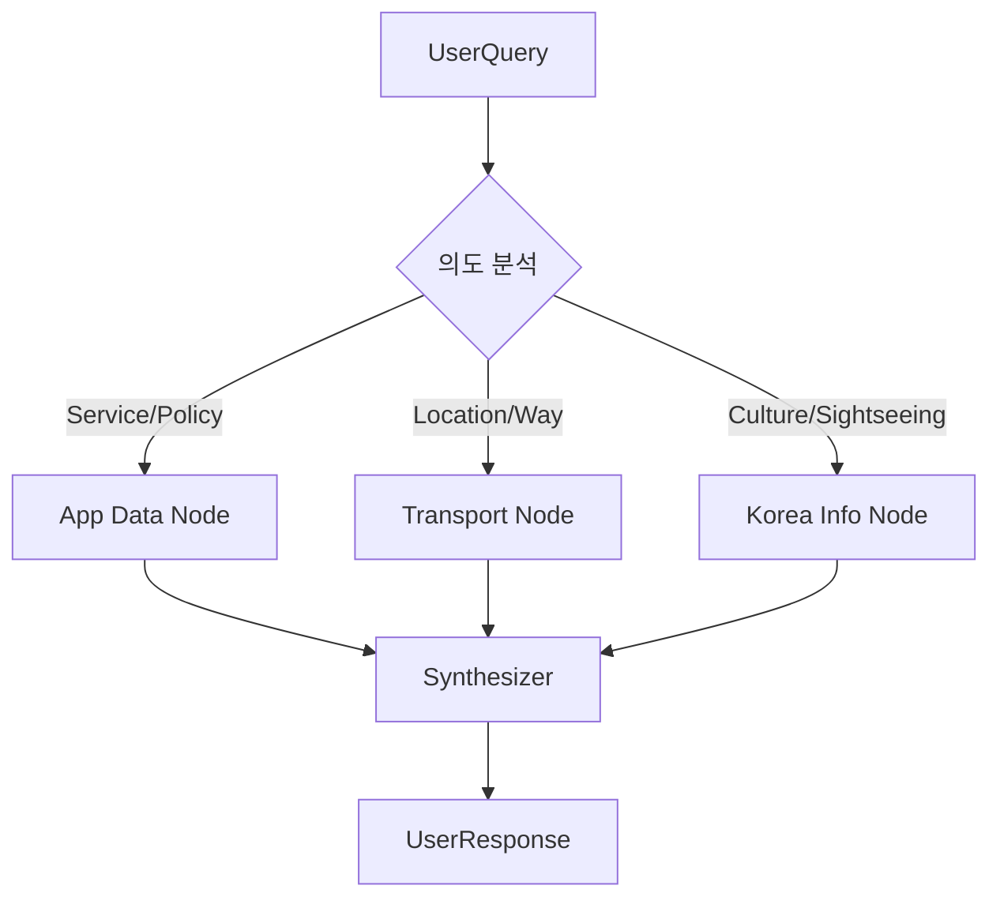

# AI Global Concierge Logic Design
> Created: 2026-02-08 03:58
> Last Updated: 2026-02-08 03:58

## 1. Context
AI 컨시어지는 사용자의 질문 의도를 분석하여, 내부 데이터베이스와 외부 API를 오가는 **복합적인 추론 과정**을 관리합니다. LangGraph를 사용하여 에이전트의 결정 과정을 명시적인 상태 머신으로 설계합니다.

## 2. Business Rules (Agent Persona)
- [ ] **Rule 1**: 페르소나는 '따뜻하고 박학다식한 시골 친구'로 설정 (존댓말 사용, 이모지 절제 혹은 따뜻한 느낌으로만 한정).
- [ ] **Rule 2**: 모르는 정보는 추측하지 않고, '호스트에게 직접 문의'하도록 안내하거나 도구를 사용하여 확인.
- [ ] **Rule 3**: 한국 여행 정보 제공 시 외국인 게스트가 이해하기 어려운 한자어나 고유명사는 쉬운 영어/한국어로 풀어서 설명.

## 3. LangGraph Workflow (Nodes & Edges)

### 3.1. Node Definitions
*   **`router`**: 게스트의 질문을 분석하여 서비스 내부 정보(Listing/Booking), 교통 정보(Transport), 일반 여행 정보(Tourism) 중 어디로 보낼지 결정.
*   **`app_logic_node`**: 서비스 내부 정책 및 숙소 데이터를 조회하고 요약.
*   **`transport_expert`**: Kakao/Mobility API를 사용하여 실시간 경로 및 이동 수단 제안.
*   **`korea_travel_expert`**: KTO API 및 Gemini 지식을 활용하여 한국 여행 팁 제공.
*   **`synthesizer`**: 각 노드에서 수집된 정보를 통합하여 최종 사용자 응답 생성.

### 3.2. Graph Visual Structure (Pseudo)


## 4. State Schema
```typescript
interface ConciergeState {
  messages: BaseMessage[];      // 대화 이력
  intent: string;               // 추출된 의도
  context: {
    listingId?: string;
    currentLocation?: Location;
    userProfile?: any;
  };
  collected_data: any[];        // 도구 호출 결과 저장소
  next_step: string;            // 다음 실행할 노드
}
```

## 5. Tool Integration Logic
에이전트가 `check_shuttle_status` 도구를 호출할 때, `05_TRANSPORT_CONCIERGE_LOGIC.md`의 비즈니스 룰을 참조하여 응답을 구성합니다.

## 6. Related Documents
- **Foundation**: [Product Specs](../01_Foundation/03_PRODUCT_SPECS.md) - AI 컨시어지 범위 및 목표
- **Specs**: [AI Concierge Spec](../03_Specs/04_AI_CONCIERGE_SPEC.md) - 기술 스택 및 데이터 명세
- **Logic**: [Transport Concierge](./05_TRANSPORT_CONCIERGE_LOGIC.md) - 교통 관련 기초 비즈니스 룰
- **Logic**: [Translation Engine](./04_TRANSLATION_ENGINE.md) - 다국어 처리 연동
- **Test**: [AI Concierge Test Plan](../05_Test/03_AI_CONCIERGE_TEST_PLAN.md) - 시나리오 기반 검증 계획
