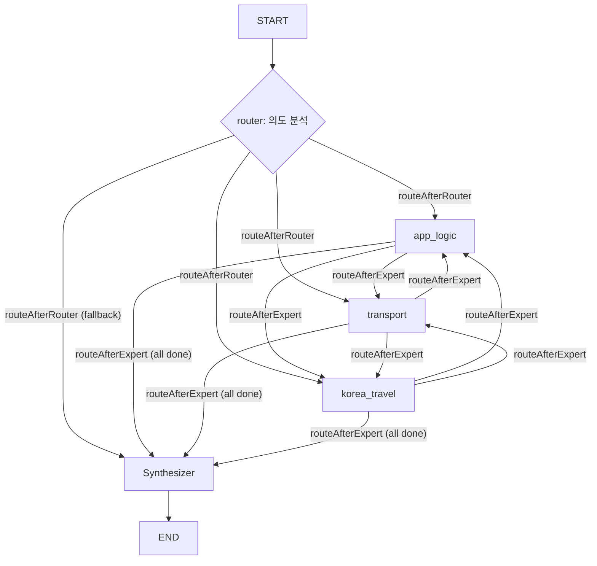

# AI Global Concierge Logic Design
> Created: 2026-02-08 03:58
> Last Updated: 2026-02-10 15:00

## 1. Context
AI 컨시어지는 사용자의 질문 의도를 분석하여, 내부 데이터베이스와 외부 API를 오가는 **복합적인 추론 과정**을 관리합니다. LangGraph를 사용하여 5노드 그래프(router -> experts -> synthesizer) 아키텍처로 구현합니다.

## 2. Business Rules (Agent Persona)
- [x] **Rule 1**: 페르소나는 '따뜻하고 박학다식한 시골 친구'로 설정 (존댓말 사용, 이모지 절제 혹은 따뜻한 느낌으로만 한정).
- [x] **Rule 2**: 모르는 정보는 추측하지 않고, '호스트에게 직접 문의'하도록 안내하거나 도구를 사용하여 확인.
- [x] **Rule 3**: 한국 여행 정보 제공 시 외국인 게스트가 이해하기 어려운 한자어나 고유명사는 쉬운 영어/한국어로 풀어서 설명.

## 3. LangGraph Workflow (Nodes & Edges)

### 3.1. Node Definitions
*   **`router`**: 게스트의 질문을 LLM structured output으로 분석하여 `intent`(service_policy/transport/tourism/complex)를 분류하고, 활성화할 전문가 노드 목록(`activatedExperts`)을 결정.
*   **`app_logic`**: 서비스 내부 정책 및 숙소 데이터를 조회하고 요약. 도구: `get_listing_details`, `check_shuttle_status`, `faq_lookup`.
*   **`transport`**: 경로 계산 시뮬레이터를 사용하여 이동 수단 및 예상 비용 제안. 도구: `calculate_route_simulator`.
*   **`korea_travel`**: 관광 정보 시뮬레이터 및 Gemini 지식을 활용하여 한국 여행 팁 제공. 도구: `search_tourism_simulator`.
*   **`synthesizer`**: 각 노드에서 수집된 `collectedData`를 통합하여 최종 사용자 응답 생성.

### 3.2. Graph Visual Structure


### 3.3. Routing Logic
*   **`routeAfterRouter`**: `activatedExperts` 배열에서 첫 번째 미완료 전문가 노드로 라우팅. 전문가가 없으면 `synthesizer`로 직행.
*   **`routeAfterExpert`**: `activatedExperts`와 `completedExperts`를 비교하여 남은 전문가가 있으면 다음 전문가로, 모두 완료되면 `synthesizer`로 라우팅.
*   각 전문가 내부에는 자체 도구 호출 루프가 있으며, 최대 3회 반복으로 무한루프를 방지.

## 4. State Schema
```typescript
// StateAnnotation (실제 구현)
{
  messages: BaseMessage[];           // 대화 이력 (messagesStateReducer)
  intent: string;                    // router가 분류한 의도
  context: Record<string, any>;      // 추출된 컨텍스트 (listingId, location 등)
  collectedData: Array<{             // 전문가별 결과 수집
    source: string;
    result: string;
  }>;
  activatedExperts: string[];        // router가 활성화한 전문가 목록
  completedExperts: string[];        // 완료된 전문가 목록
}
```

## 5. Tool Integration Logic
*   각 전문가 노드는 `runExpertLoop()` 헬퍼를 통해 자체 도구 호출 루프를 실행.
*   `check_shuttle_status` 호출 시 `05_TRANSPORT_CONCIERGE_LOGIC.md`의 비즈니스 룰을 참조.
*   `get_listing_details`는 `hostId` 등 민감 필드를 제외하고 반환.

## 6. Related Documents
- **Foundation**: [Product Specs](../01_Concept_Design/03_PRODUCT_SPECS.md) - AI 컨시어지 범위 및 목표
- **Specs**: [AI Concierge Spec](../03_Technical_Specs/04_AI_CONCIERGE_SPEC.md) - 기술 스택 및 데이터 명세
- **Logic**: [Transport Concierge](./05_TRANSPORT_CONCIERGE_LOGIC.md) - 교통 관련 기초 비즈니스 룰
- **Logic**: [Translation Engine](./04_TRANSLATION_ENGINE.md) - 다국어 처리 연동
- **Test**: [AI Concierge Test Plan](../05_QA_Validation/03_AI_CONCIERGE_TEST_PLAN.md) - 시나리오 기반 검증 계획
